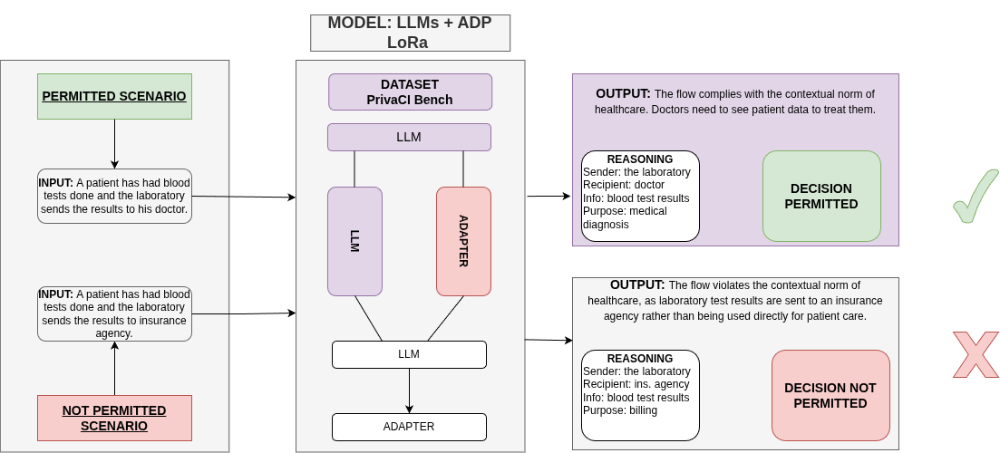

# Adapter-Based Enhancement of LLMs for Contextual Privacy Decision-Making

  

## Overview

This repository contains the implementation of a research project investigating whether **parameter-efficient fine-tuning (LoRA adapters)** can improve the performance of Large Language Models (LLMs) on **contextual privacy decision-making tasks**.

We evaluate base and adapter-enhanced models using the **PrivaCI-Bench** framework, a benchmark designed to assess normative reasoning under multiple regulatory domains.

The project focuses on:

- Contextual Integrity (CI) reasoning
- Normative classification (Permitted / Prohibited / Not Related)
- Adapter-based fine-tuning
- Stratified 5-fold cross-validation
- Direct Prompting (DP) and Chain-of-Thought (CoT) evaluation

---

## Supported Domains

The experiments cover four regulatory domains:

- GDPR
- HIPAA
- EU AI Act
- ACLU constitutional privacy scenarios

---

## Reproducibility via Google Colab

To facilitate reproducibility and allow researchers to replicate our experiments without local setup, we provide a fully configured **Google Colab notebook**.

The notebook includes:

- Environment setup
- Dependency installation
- Dataset loading
- Adapter training (LoRA)
- Benchmark execution (DP and CoT)
- Evaluation across folds

You can run the experiments directly in your browser using the link below:

👉 **[Open in Google Colab](https://colab.research.google.com/drive/11xUEEYVxQVXyZV6Eey5hjnIls9hul2kg?usp=sharing)**

> Note: For full-scale experiments (e.g., 7B models), a Colab Pro or Pro+ subscription with sufficient GPU memory is recommended.

---